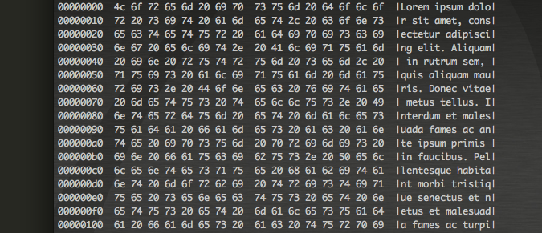

# The ASCII Art Test

We would like you to solve a small programming challenge for us and we would like you to write JavaScript to solve this challenge, however as you will see, you shouldn’t need to write much.

With the software we’re currently developing, we spend an amount of time dealing with raw hex data and we’ve had to find a way to display this to the user so it’s simple for them to understand. To this end, we would like you to create a small javascript application that provided with some hexadecimal data, will format and display it’s ASCII representation.

Above is the format of the display we are looking for. The different columns show the offset of the line within the data (using hexadecimal) followed by two larger columns of hex data and the final column is the ASCII representation of the line. This is a canonical hexdump format.

We don’t want you to spend hours solving this problem, but we would like to see a complete and well presented solution that we can run and see the output in a console or a web browser.

You can [find the hex data for this test in here](AsciiArt/data.hex)